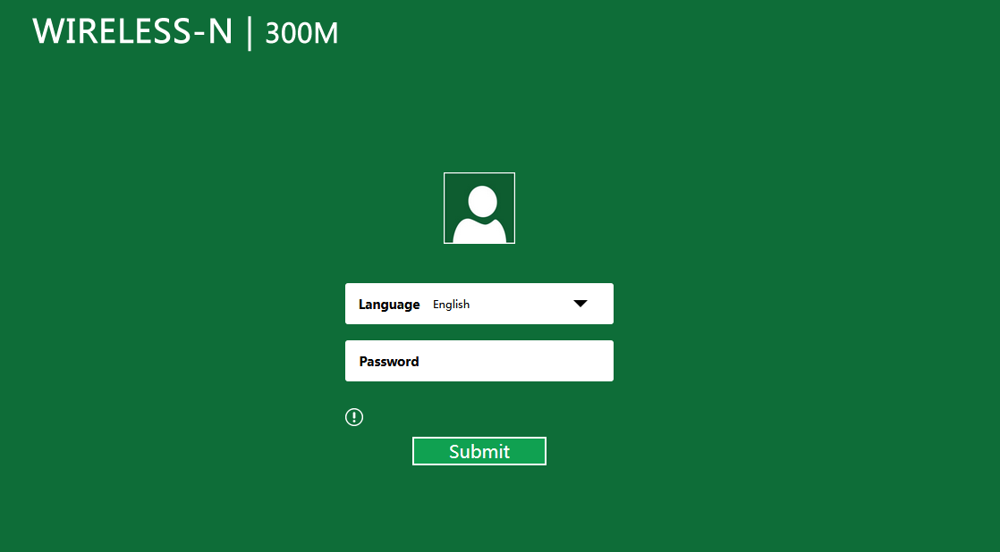

# CVE-2025-63422 - Incorrect access control allows to arbitrarily change the administrator username and password

## Affected Product
- Vendor/Brand: Each Italy
- Device: Wireless Mini Router WIRELESS-N 300M
- Firmware: v28K.MiniRouter.20190211

## Summary

<p>The Web management interface of the device allows an unauthenticated attacker to arbitrarily change the administrator username and password by sending a crafted HTTP GET request.</p>
<p>This changes the credentials for both the Web interface and the Telnet debug interface described in CVE-2025-57428, potentially allowing the attacker to access the telnet debug interface even if the default password was changed as a mitigation.</p>
<p>The login page of the Web interface only requires the password, while the username is hardcoded to "admin" by the page and is not visible to the user. If the attacker changes the username, legitimate users will no longer be able to log in.</p>

## Proof of Concept
Sending this request is sufficient to perform the attack:
```bash
curl "http://<device-ip>/pass.htm?CMD=SYS&GO=login.htm&SET0=17498624=<new username>&SET1=16843264=<new password>"
```


Observations:
   - Changing the admin credentials via this request also changes Telnet credentials, indicating shared credentials.
   - Changing the username locks legitimate users out of the Web management interface.

## Vendor Communication
Attempts to find any security contact or support channel of the original vendor were unsuccessful. The product appears to be a rebranded device of unknown origin.

## Disclaimer
This information is provided for educational and defensive purposes only. The author takes no responsibility for any misuse of this information.