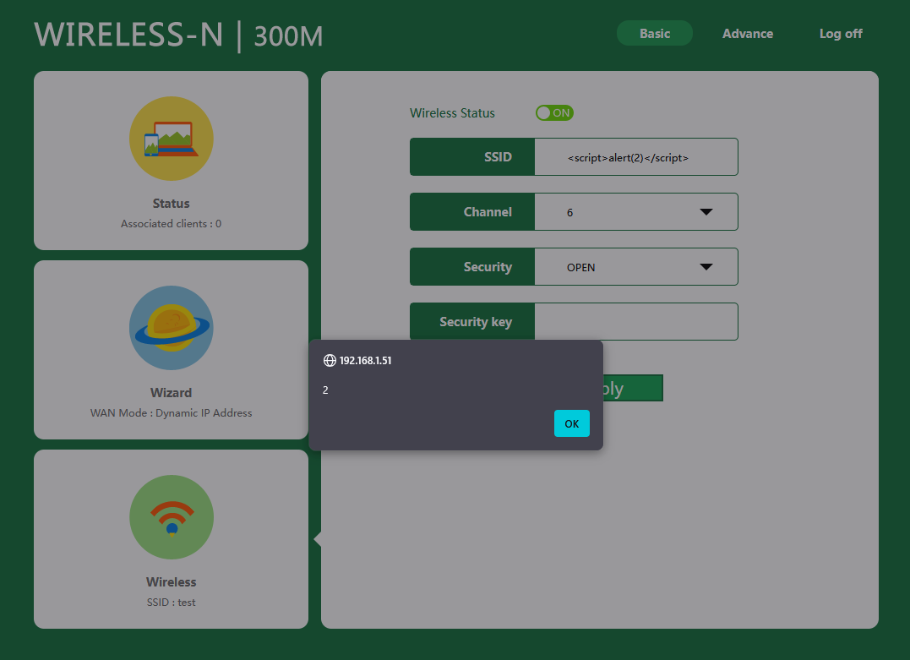
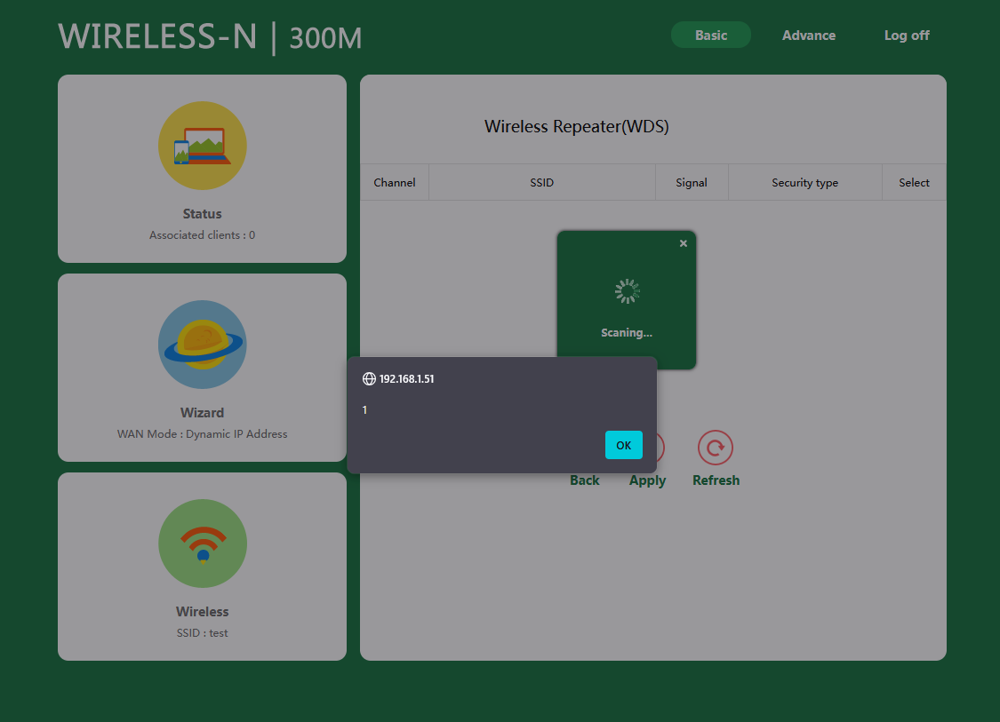

# CVE-2025-65349 - Multiple Stored Cross-Site Scripting (XSS) vulnerabilities via unsanitized SSID values

## Affected Product
- Vendor/Brand: Each Italy
- Device: Wireless Mini Router WIRELESS-N 300M
- Firmware: v28K.MiniRouter.20190211

## Summary

<p>The Web management interface of the device is vulnerable to multiple Stored Cross-Site Scripting (XSS) attacks through unsanitized SSID values.</p>
<p>These vulnerabilities allow attackers to inject and execute arbitrary JavaScript code in the context of users browsers, leading to session hijacking, credential theft, device configuration manipulation, and denial of service.</p>

### Stored XSS via Repeater AP SSID Configuration

<p>The device fails to sanitize the repeater AP SSID value when it is displayed across pages in `/index.htm`. An attacker can inject a malicious payload that gets executed every time (almost) any page within the Web interface is accessed.</p>
<p>The vulnerability can be exploited remotely without authentication by sending a crafted HTTP GET request to set a malicious SSID value. Additionally, authenticated attackers can set the payload through the normal configuration interface.</p>

### Stored XSS via Malicious SSID in Repeater Scan Interface

<p>The device fails to sanitize SSID values received from wireless networks when displaying the list of available access points in the "Wireless Repeater Mode" configuration page. An attacker can broadcast a malicious SSID that gets executed when a user accesses the repeater mode setup.</p>
<p>The attacker creates a rogue access point (or sends beacon frames) with an SSID containing the payload. When a user navigates to the Wireless Repeater Mode configuration and the device scans for available networks, the malicious payload is executed in the user's browser.</p>

## Proof of Concept

### Stored XSS via Repeater AP SSID Configuration

Sending this request is sufficient to inject a stored XSS payload without authentication:
```bash
curl "http://<device IP>/index.htm?CMD=SYS&GO=login.htm&SET0=71041536=<script>alert(2)</script>"
```

This payload executes every time any page in `/index.htm` is opened, displaying an alert box and potentially rendering the interface unusable.



Furthermore, using this method the SSID limit can be bypassed and a payload like this can work without problems:
```bash
curl "http://<device IP>/index.htm?CMD=SYS&GO=login.htm&SET0=71041536=<script>window.location.href='http://www.google.com'</script>"
```

This example redirects users to google.com, but attackers can use this to redirect users to a site controlled by them, allowing phishing attacks or credential harvesting.

Observations:
   - Authenticated attackers can set the payload through the normal configuration interface.

### Stored XSS via Malicious SSID in Repeater Scan Interface

An attacker can create a rogue wireless access point with the following SSID:
```
<script>alert(1)</script>
```

When a user navigates to **Wizard > Wireless Repeater Mode** in the Web interface, the malicious SSID is displayed in the list of available networks, and the payload executes immediately.



Observations:
   - Multiple beacon frames with different SSID values can be broadcast to bypass SSID length limitations and inject more sophisticated payloads.

## Vendor Communication
Attempts to find any security contact or support channel of the original vendor were unsuccessful. The product appears to be a rebranded device of unknown origin.

## Disclaimer
This information is provided for educational and defensive purposes only. The author takes no responsibility for any misuse of this information.